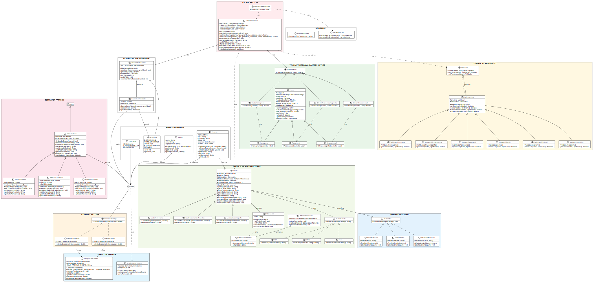

# Sistema de Gerenciamento de Exames - ST Diagnósticos

Este projeto visa atender às necessidades da ST Diagnósticos, oferecendo um sistema flexível, reutilizável e de fácil manutenção para gerenciamento de exames médicos, emissão de laudos e comunicação com pacientes. A solução foi desenvolvida com foco na aplicação de padrões de projeto para garantir extensibilidade e desacoplamento entre os componentes do sistema.

## Integrantes do Grupo

| Nome               | Matrícula     |
|--------------------|---------------|
| Alessandro Rodrigues de Souza Júnior | 20231370009 |
| Bruno Vinicius de Araujo Eneas | 20231370015 |
| Caio Batista da Silva Soares | 20231370010 |
| Douglas Emerson Ferreira Carneiro | 20231370002 |

## Estrutura da Solução

A arquitetura do sistema foi construída com base em diversos padrões de projeto. Cada requisito funcional foi analisado individualmente e resolvido com um ou mais padrões que melhor se aplicam ao cenário descrito.

---

## Diagrama de Classes


# Requisitos Funcionais e Padrões Aplicados

## Tabela Resumo: Requisitos e Padrões de Projeto

| Requisito | Descrição resumida                                                      | Padrão de Projeto Aplicado |
|-----------|-------------------------------------------------------------------------|-----------------------------|
| R1        | Carregar dados necessários a partir de arquivos CSV                    | Utility Class(Utils)               |
| R2        | Geração de número sequencial único para exames                         | Singleton                   |
| R3        | Emitir laudos para exames: Sanguíneo, Raio-X e Ressonância Magnética  | Factory Method + Template Method + Decorator |
| R4        | Geração de laudos em múltiplos formatos (texto, HTML, PDF, etc.)       | Bridge                      |
| R5        | Validação extensível de exames                                          | Chain of Responsibility     |
| R6        | Notificação ao paciente por e-mail (e futuramente SMS, Telegram)       | Observer                    |
| R7        | Aplicação de políticas de desconto (convênio, idoso, etc.)             | Strategy                    |
| R8        | Priorização de laudos usando lista de prioridade (URGENTE, POUCO URGENTE, ROTINA) | Priority Queue(Estrutura de Dados) |
| R9        | Programa principal simulando execução e atendimento dos requisitos     | Facade                      |
| R10       | Controle de versões das observações médicas                            | Memento                     |

---

## 🚀 Execução Rápida

### Método Recomendado (Makefile)
```bash
# Executar o sistema completo
make run

# Ver demonstração de configuração
make demo

# Ajuda completa
make help
```

---

## Requisito R1 - Carregar os dados necessários a partir de arquivos CSV

Utility Class

**Como será utilizado:**  
A classe `CarregadorCSV` fornece métodos estáticos para carregar dados de pacientes, médicos solicitantes, médicos responsáveis pelo laudo e outros dados necessários a partir de arquivos CSV. Esta classe contém apenas métodos utilitários sem estado, seguindo o padrão de classe utilitária.

**Justificativa:**  
Centraliza a lógica de carregamento de dados, promovendo reutilização e mantendo a responsabilidade bem definida para operações de I/O com arquivos CSV. Facilita a manutenção e permite carregar diferentes tipos de dados médicos de forma consistente.

---

## Requisito R2 - Gerar o número sequencial do exame, sem repetição

**Padrão de Projeto Aplicado:** Singleton

**Como será utilizado:**  
Será criada a classe `GeradorNumeroExame`, responsável pela lógica de geração de identificadores únicos. Essa classe seguirá o padrão Singleton, garantindo que apenas uma instância exista durante toda a execução da aplicação.

**Justificativa:**  
Garante unicidade na geração dos números de exame, evitando conflitos, duplicações ou inconsistências, especialmente em ambientes concorrentes.

---

## Requisito R3 - Emitir laudo dos exames: Sanguíneo, Raio-X e Ressonância Magnética

**Padrão de Projeto Aplicado:** Factory Method + Template Method + Decorator

**Como será utilizado:**  
- **Factory Method**: Cada tipo de exame (`Hemograma`, `Ultrassonografia`, `Ressonancia`) será instanciado por fábricas concretas (`CriadorHemograma`, `CriadorUltrassonografia`, `CriadorRessonanciaMagnetica`) que herdam da classe abstrata `CriadorExame`.
- **Template Method**: A classe abstrata `Exame` define o algoritmo geral para realização de exames, com etapas específicas implementadas pelas subclasses.
- **Decorator**: Para exames sanguíneos, indicadores específicos (`IndicadorGlicemia`, `IndicadorColesterol`, `IndicadorCreatinina`) podem ser adicionados dinamicamente ao exame base.

**Justificativa:**  
A combinação desses padrões permite criar diferentes tipos de exames de forma desacoplada (Factory Method), seguir um fluxo padronizado (Template Method), e adicionar indicadores específicos para exames sanguíneos sem modificar a estrutura base (Decorator). Atende ao princípio Open/Closed.

---

## Requisito R4 - Gerar laudos em diferentes formatos: texto puro, HTML e PDF

**Padrão de Projeto Aplicado:** Bridge

**Como será utilizado:**  
Será criada a abstração `Laudo` (com subclasses como `LaudoHemograma`, `LaudoRessonanciaMagnetica`), que conterá uma referência a um objeto da interface `FormatoLaudo`. As classes concretas de formato (`PDF`, `HTML`, `Texto`) implementarão a lógica de geração no formato específico.

**Justificativa:**  
Permite variar independentemente o conteúdo dos laudos e seu formato de saída. Facilita a adição de novos formatos (como JSON) sem alteração nas abstrações principais dos laudos.

---

## Requisito R5 - Adicionar as regras de validação de cada exame, de maneira extensível

**Padrão de Projeto Aplicado:** Chain of Responsibility

**Como será utilizado:**  
Cada regra de validação será encapsulada em classes que herdam de `ValidadorBase` (como `ValidacaoHemograma`, `ValidacaoUltrassonografia`, `ValidacaoRessonancia`, `ValidacaoGlicemia`, etc.). Esses validadores serão encadeados em uma cadeia, permitindo que cada um execute sua verificação e repasse o controle ao próximo.

**Justificativa:**  
Permite uma estrutura modular e flexível para validações. Novas regras podem ser adicionadas, removidas ou reorganizadas sem impactar o fluxo principal ou os validadores existentes. Cada tipo de exame pode ter suas validações específicas.

---

## Requisito R6 - Notificar o paciente quando um laudo for emitido, por e-mail

**Padrão de Projeto Aplicado:** Observer

**Como será utilizado:**  
A classe `Laudo` atuará como sujeito (Subject), notificando observadores como `EmailNotificador`, `SmsNotificador`, `WhatsAppNotificador`. Ao emitir um laudo, todos os observadores registrados são automaticamente notificados.

**Justificativa:**  
Facilita a adição de novos mecanismos de notificação (SMS, Telegram) sem alterar a lógica de emissão de laudos, promovendo baixo acoplamento e alta extensibilidade.

---

## Requisito R7 - Aplicação de políticas de desconto para exames

**Padrão de Projeto Aplicado:** Strategy

**Como será utilizado:**  
A lógica de desconto será encapsulada em classes concretas que implementam a interface `DescontoStrategy`, como `DescontoConvenio` (15%) e `DescontoIdoso` (8%). A classe `Exame` aplicará dinamicamente a estratégia adequada com base no perfil do paciente.

**Justificativa:**  
Encapsula políticas de desconto em componentes independentes e reutilizáveis. Facilita a manutenção e extensão da lógica de negócio (como "Outubro Rosa") sem impactar o sistema principal, além de permitir configuração dinâmica dos percentuais via `ConfiguracaoSistema`.

---

## Requisito R8 - Implementar priorização de laudos usando lista de prioridade

**Padrão de Projeto Aplicado:** Priority Queue

**Como será utilizado:**  
A classe `FilaPrioridadeExames` gerencia exames encapsulados em `ExameComPrioridade` usando o enum `Prioridade` (EMERGENCIA, MUITO_URGENTE, URGENTE, POUCO_URGENTE, ROTINA). A fila garante o processamento de laudos mais críticos primeiro.

**Justificativa:**  
Abstrai a ordenação dos exames de acordo com a prioridade médica, tornando o sistema mais eficiente, legível e de fácil manutenção, seguindo protocolos hospitalares reais.

---

## Requisito R9 - Implementar programa principal simulando execução da aplicação

**Padrão de Projeto Aplicado:** Facade

**Como será utilizado:**  
A classe `LaboratorioFacade` atuará como uma fachada, unificando funcionalidades como criação de exames, aplicação de descontos, geração de laudos, processamento da fila de prioridade e notificações. A classe principal `SistemaExamesMedicos` e outras camadas interagirão apenas com essa fachada.

**Justificativa:**  
Fornece uma interface simplificada para operações complexas, reduzindo o acoplamento entre subsistemas e facilitando integrações. Centraliza o controle do fluxo principal do sistema e demonstra todos os requisitos funcionais.

---

## Requisito R10 - Controle de versões das observações médicas nos exames

**Padrão de Projeto Aplicado:** Memento

**Como será utilizado:**  
A classe `HistoricoObservacao` armazenará versões anteriores das observações através de `ObservacaoMemento`. A classe `Observacao` poderá criar mementos e restaurar qualquer versão salva antes da finalização do laudo.

**Justificativa:**  
Oferece suporte à reversão de alterações e versionamento, o que é essencial em sistemas sensíveis como laudos médicos. Permite rastreabilidade e auditoria das modificações feitas durante a elaboração dos laudos.

---

## 🔧 Funcionalidades Avançadas

### 💾 Sistema de Configuração
- **Arquivo**: `config/sistema.properties`
- **Recursos**: Caminhos CSV, percentuais de desconto, dados do laboratório, configurações de email
- **Persistência**: Configurações salvas automaticamente
- **Flexibilidade**: Modificação dinâmica via `ConfiguracaoSistema`

```properties
# Exemplo de configuração
csv.pacientes.caminho=dados/pacientes.csv
csv.medicos.caminho=dados/medicos.csv
desconto.convenio.percentual=15
desconto.idoso.percentual=8
email.remetente=douglas.carneiro@academico.ifpb.edu.br
email.destinoDev=caio.soares@academico.ifpb.edu.br
notificacao.email.ativo=dev
```

### 📁 Carregamento de Dados CSV
- **Pacientes**: `dados/pacientes.csv` (nome, cpf, convenio, idade)
- **Médicos**: `dados/medicos.csv` (nome, crm, especialidade)
- **Auto-criação**: Arquivos de exemplo criados automaticamente
- **Robustez**: Tratamento de erros e validação de dados

## 📊 Mapeamento Domínio → Padrões

| Domínio | Padrões Aplicados | Responsabilidade |
|---------|-------------------|------------------|
| **modelo** | Entities, Enums | Entidades de negócio (Paciente, Medico, Prioridade, TipoExame) |
| **exames** | Factory Method, Template Method, Decorator | Criação, execução e decoração de exames |
| **laudos** | Bridge, Memento, Observer | Geração, versionamento e notificação |
| **validacao** | Chain of Responsibility | Validações por tipo e indicador |
| **notificacao** | Observer | Comunicação multi-canal |
| **financeiro** | Strategy | Políticas de desconto configuráveis |
| **gestao** | Priority Queue | Gerenciamento de filas por prioridade |
| **sistema** | Facade | Interface simplificada para operações complexas |
| **utils** | Singleton, Utility Classes | Configurações e utilitários compartilhados |

---

## Conclusão

Este projeto demonstra como a aplicação adequada de padrões de projeto proporciona uma arquitetura robusta, extensível e de fácil manutenção. Cada requisito foi implementado com foco em boas práticas de orientação a objetos, favorecendo reutilização, clareza e desacoplamento. A integração de múltiplos padrões cria um sistema coeso que atende às necessidades reais de um laboratório médico, com capacidade de evolução e adaptação a novos requisitos.
